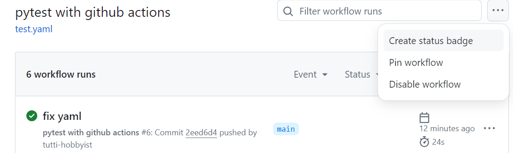

# pytest_practice
This repository contains pytest practice files

## Test status

## How to show the test status
1. Go to actions tab.
2. Select `Create status badge`
  
3. Copy displayed codes and paste it in a markdown.
